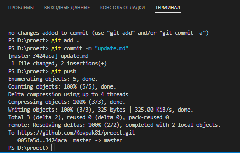

[< к списку команд](../command.md)

---

## git commit

---

**git  commit *[команда]*** -
    Команда git commit берёт все данные, добавленные в индекс с помощью git add, и сохраняет их слепок во внутренней базе данных, а затем сдвигает указатель текущей ветки на этот слепок.


Используйте команду:

```bash=
git commit
```

---

**Работа команды в VS Code**

