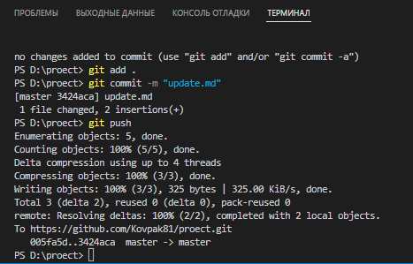

[< к списку команд](../command.md)

---

## git push

---

**git push *[команда]*** -
   Команда git push используется для установления связи с удалённым репозиторием, вычисления локальных изменений отсутствующих в нём, и собственно их передачи в вышеупомянутый репозиторий. Этой команде нужно право на запись в репозиторий, поэтому она использует аутентификацию.


Ииспользуйте команду:

```bash=
git push
```

---

**Работа команды в VS Code**

