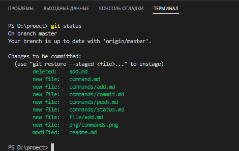

[< к списку команд](../command.md)

---

## git status

---

**git status *[команда]*** -
    Команда git status показывает состояния файлов в рабочем каталоге и индексе: какие файлы изменены, но не добавлены в индекс; какие ожидают коммита в индексе. Вдобавок к этому выводятся подсказки о том, как изменить состояние файлов.

Чтобы посмотреть состояние файлов, используйте команду:

```bash=
git status
```

---

**Работа команды в VS Code**

